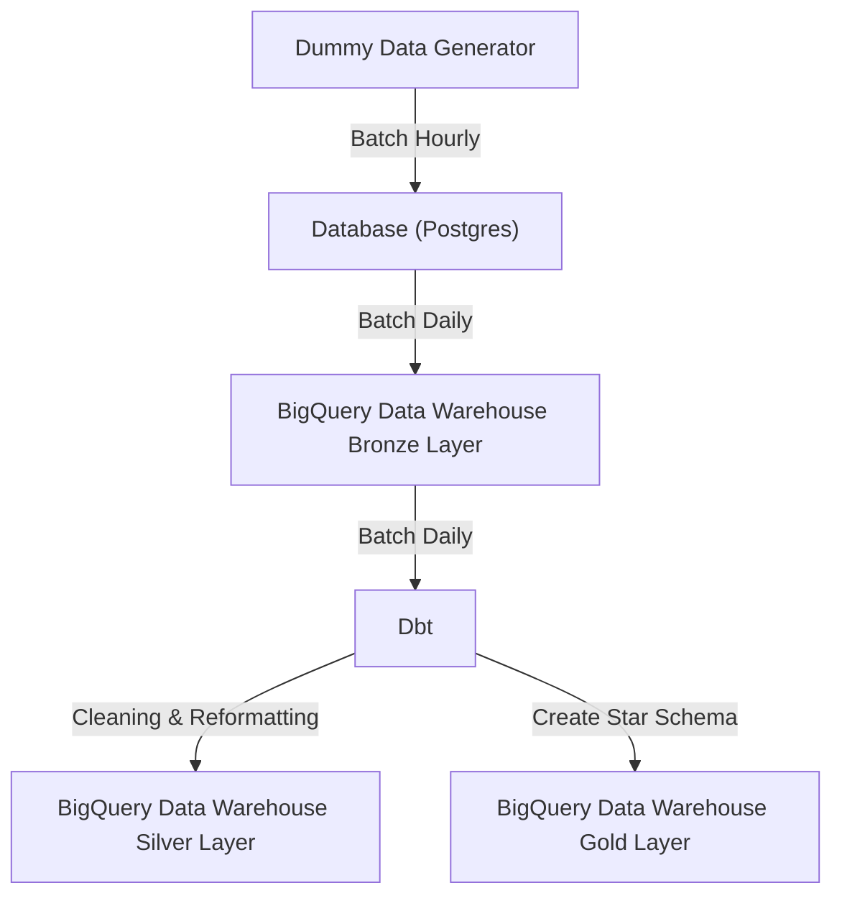

# ELT Pipeline and Data Warehouse Modeling using Airflow, Postgres, dbt and BigQuery

## Overview

This project is to demonstrate ELT data pipeline project that utilized Dbt and BigQuery for data warehouse creatioon, Airflow for workflow scheduler, Postgres for source database and python as the main language.

## Technology Used
- **Python**
- **Docker**
- **Apache Airflow**
- **Postgres**
- **BigQuery**
- **dbt**

## Abstract

This project will demonstrate an ELT pipeline where data is first generated using Python and loaded into a local PostgreSQL database. It is then transferred to BigQuery via the BigQuery hook. The data is subsequently transformed into a data warehouse structure using dbt. The entire data pipeline workflow is scheduled with Airflow.
The end result is transformed data stored in a data warehouse built on BigQuery and dbt, following a medallion architecture with three layers:
- Bronze/Staging layer
- Silver/Refined layer
- Gold/Business (Star Schema) layer

## Pipeline flow
